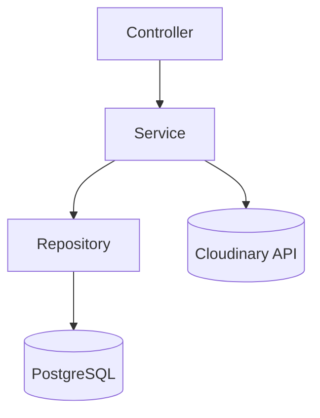
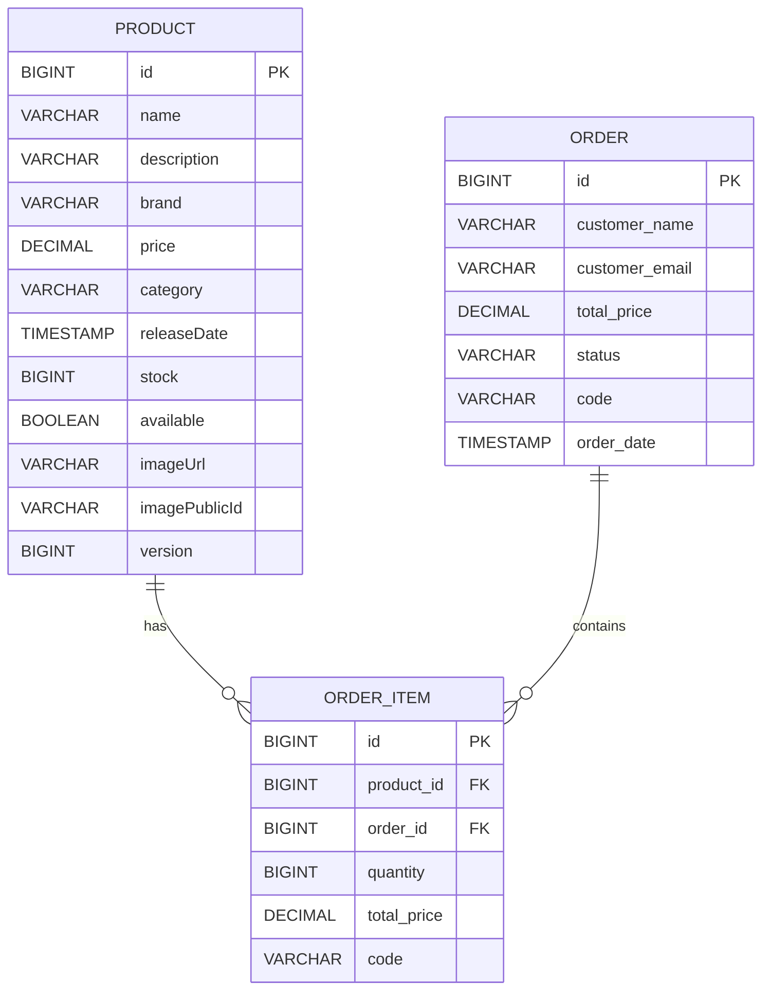

# 🛍️ Spring Order Service API

## 📖 Project Description
The **Spring Order Service API** is a production-ready REST API focused on **order processing and stock management** for e-commerce applications.  
It supports **placing orders with multiple items, automatic stock deduction, and optimistic locking**, following **clean architecture best practices** (DTOs, Mappers, Layered Services, Centralized Error Handling).

## ✨ Features

| Feature | Description |
|---------|-------------|
| 🛒 Product Management | Create, update, delete, and search products |
| 📷 Image Handling | Upload & manage product images via Cloudinary |
| 📦 Order Processing | Place orders with multiple items |
| 🔐 Validation | Comprehensive input validation & centralized error handling |
| 📊 Stock Management | Automatic stock deduction with optimistic locking |
| 🧾 Order Tracking | Retrieve orders and detailed order items |

## 🏗️ Architecture Overview



## 📂 Project Structure

<details>
<summary>Click to expand!</summary>

```
📦src/main/java/org/ecommercapp/ecommerce
 ┣ 📂image
 ┃ ┣ 📂controller
 ┃ ┃ ┗ 📜ImageController.java
 ┃ ┣ 📂dto
 ┃ ┃ ┗ 📜ImageUploadResponse.java
 ┃ ┗ 📂service
 ┃ ┃ ┣ 📂impl
 ┃ ┃ ┃ ┗ 📜ImageServiceImpl.java
 ┃ ┃ ┗ 📜ImageService.java
 ┣ 📂order
 ┃ ┣ 📂controller
 ┃ ┃ ┗ 📜OrderController.java
 ┃ ┣ 📂dto
 ┃ ┃ ┣ 📂order
 ┃ ┃ ┃ ┣ 📜OrderRequestDto.java
 ┃ ┃ ┃ ┗ 📜OrderResponseDto.java
 ┃ ┃ ┗ 📂orderItem
 ┃ ┃ ┃ ┣ 📜OrderItemRequestDto.java
 ┃ ┃ ┃ ┗ 📜OrderItemResponseDto.java
 ┃ ┣ 📂entity
 ┃ ┃ ┣ 📜Order.java
 ┃ ┃ ┗ 📜OrderItem.java
 ┃ ┣ 📂mapper
 ┃ ┃ ┣ 📜OrderItemMapper.java
 ┃ ┃ ┗ 📜OrderMapper.java
 ┃ ┣ 📂repo
 ┃ ┃ ┗ 📜OrderRepo.java
 ┃ ┗ 📂service
 ┃ ┃ ┣ 📂impl
 ┃ ┃ ┃ ┗ 📜OrderServiceImpl.java
 ┃ ┃ ┗ 📜OrderService.java
 ┣ 📂product
 ┃ ┣ 📂controller
 ┃ ┃ ┗ 📜ProductController.java
 ┃ ┣ 📂dto
 ┃ ┃ ┣ 📜ProductCreateDto.java
 ┃ ┃ ┣ 📜ProductResponseDto.java
 ┃ ┃ ┗ 📜ProductUpdateDto.java
 ┃ ┣ 📂entity
 ┃ ┃ ┗ 📜Product.java
 ┃ ┣ 📂mapper
 ┃ ┃ ┗ 📜ProductMapper.java
 ┃ ┣ 📂repo
 ┃ ┃ ┗ 📜ProductRepo.java
 ┃ ┗ 📂service
 ┃ ┃ ┣ 📂impl
 ┃ ┃ ┃ ┗ 📜ProductServiceImpl.java
 ┃ ┃ ┗ 📜ProductService.java
 ┣ 📂shared
 ┃ ┣ 📂config
 ┃ ┃ ┗ 📂cloudinary
 ┃ ┃ ┃ ┣ 📜CloudinaryConfig.java
 ┃ ┃ ┃ ┗ 📜CloudinaryProperties.java
 ┃ ┣ 📂dto
 ┃ ┃ ┗ 📜ApiResponse.java
 ┃ ┣ 📂exception
 ┃ ┃ ┣ 📜DuplicateResourceException.java
 ┃ ┃ ┣ 📜GlobalExceptionHandler.java
 ┃ ┃ ┣ 📜RecordNotFoundException.java
 ┃ ┃ ┗ 📜StockDeductionException.java
 ┃ ┗ 📂util
 ┃ ┃ ┣ 📜CodeGenerator.java
 ┃ ┃ ┗ 📜ResponseBuilder.java
 ┗ 📜ECommerceApplication.java
```
</details>

## 🔗 API Endpoints

| Method | Endpoint |
|---------|----------|
| `POST` | `/api/products` |
| `GET` | `/api/products` |
| `GET` | `/api/products/{id}` |
| `GET` | `/api/products/search?keyword={keyword}` |
| `PUT` | `/api/products/{id}` |
| `DELETE` | `/api/products/{id}` |
| `POST` | `/api/orders/place` |
| `GET` | `/api/orders` |
| `POST` | `/api/images/upload` |
| `DELETE` | `/api/images/{publicId}` |

## 🗄️ Database Schema



## 📥 Installation & Usage

### Requirements
- Java 21 or higher
- Maven
- PostgreSQL
- Cloudinary account

### Steps

```bash
# 1. Clone repo
git clone https://github.com/yourusername/ecommerce-api.git
cd ecommerce-api
```

```bash
# 2. Configure .env
DB_URL=jdbc:postgresql://localhost:5432/ecom
DB_USERNAME=postgres
DB_PASSWORD=your_password
CLOUDINARY_CLOUD_NAME=your_cloud_name
CLOUDINARY_API_KEY=your_api_key
CLOUDINARY_API_SECRET=your_api_secret
```

```bash
# 3. Build & Run
mvn clean install
mvn spring-boot:run
```

The API will be available at:
👉 **http://localhost:8080**

## 🧰 Tech Stack

- Java 21
- Spring Boot 3.5.5
- Spring Data JPA
- Spring Validation
- MapStruct
- Lombok
- PostgreSQL
- Cloudinary
- Maven

## 🤝 Contribution

Contributions, issues, and feature requests are welcome!
